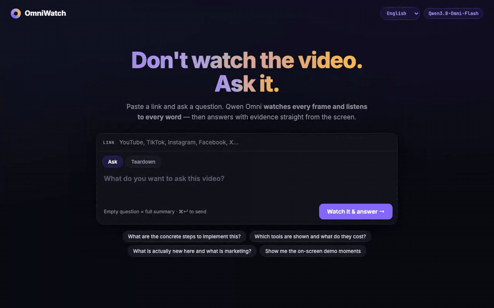

# 🎬 OmniWatch — don't watch the video, ask it

Paste a link (YouTube, TikTok, Instagram, Facebook, X…), ask a question, and **Qwen3.8-Omni-Flash actually watches the video** — every frame and every word — then answers with evidence: timestamps plus the real frames from the video.

It is **not** a transcript summarizer. It sees the slides, the demos, the code on screen, the charts, the editing.



**Two modes:**

| Mode | What you get |
|---|---|
| **Ask** | An answer to your question + evidence from the video + what the video *doesn't* say + where to jump |
| **Teardown** | How a video is *made*: the hook, beat by beat, editing & pacing, on-screen text, sound, CTA — and a ready shot-by-shot script for **your** topic |

Teardown is the competitor-research one: point it at a TikTok/Reel/Short that is working in your niche and you get the formula behind it, not just the topic.

Answers come in **English, Polish, German, Spanish or French** (picker in the top right).

---

## 🟢 The easy way — let your AI agent install it

You do not need to understand any of this. If you use Claude Code, Codex, Cursor, Gemini CLI or Hermes:

1. Download this repo (green **Code** button → **Download ZIP**) and unzip it.
2. Open your agent **inside that folder**.
3. Paste this:

> **"Read INSTALL-WITH-AI.md and set up OmniWatch for me, step by step. Ask me whenever you need a key or a decision."**

The agent installs the three tools it needs, asks you for your Qwen API key, and starts the app at <http://localhost:8765>.

---

## 🔧 The manual way (5 minutes)

**1. Install the three tools** (Mac — with [Homebrew](https://brew.sh)):

```bash
brew install ffmpeg
curl -LsSf https://astral.sh/uv/install.sh | sh
uv tool install yt-dlp
```

On Windows, with [Scoop](https://scoop.sh): `scoop install ffmpeg uv` then `uv tool install yt-dlp`.

**2. Get a Qwen API key** — [Alibaba Model Studio](https://modelstudio.console.alibabacloud.com) → API keys. New accounts get free credits; after that a question about a 10-minute video costs about **$0.03**.

**3. Add your key:**

```bash
cp .env.example .env      # then paste your key into .env
```

**4. Start it:**

```bash
uv run app.py             # → http://localhost:8765
```

That's it. Paste a link, ask a question. Or from the terminal:

```bash
uv run omniwatch.py 'https://youtu.be/…' -q 'What tools does he show and what do they cost?'
uv run omniwatch.py 'https://www.tiktok.com/@user/video/123' --teardown -q 'AI automation for small businesses'
```

---

## How it works

1. **yt-dlp** downloads the video (≤480p — plenty to read slides and code)
2. It is uploaded to **Model Studio temporary storage** (`oss://`, 48 h, free) — follow-up questions about the same video don't re-upload it
3. **One request** to Qwen3.8-Omni-Flash with the whole video → the answer streams in
4. The timeline strip lights up the moments the answer cites; click one to jump there

**Frame rate:** videos up to 3 minutes (shorts, TikToks, Reels — fast cuts) are sampled at **10 fps**, the API maximum. Longer videos use the API default of **2 fps**.

**Long videos:** at 480p/2 fps a video costs ~350 tokens per second, so anything over **40 minutes** (courses, streams) is split into equal parts, watched in parallel, then merged into one answer.

**Your disk:** downloaded videos live in `.cache/` and are deleted automatically after 48 h of not being used (the copy at Qwen expires then too). Answers are kept as small markdown files in `summaries/`.

## Settings

All optional, in `.env`: `OMNI_LANG`, `OMNI_MODEL`, `DASHSCOPE_API` (region endpoint), `OMNI_CACHE_HOURS`, `OMNI_PART_MINUTES`.

## Notes on the API (measured, not guessed)

- A YouTube link passed straight to the API is rejected — the file has to be downloaded first.
- base64 video input is capped at 10 MB; an `oss://` URL takes up to 2 h / 2 GB.
- `fps` is accepted only between 0.1 and 10; tokens scale linearly with it.
- Thinking mode is on by default and only adds latency here, so it is switched off (`enable_thinking: false`): first token drops from ~17 s to a couple of seconds.
- Alibaba's **Token Plan** does not include an Omni model; its vision models see the picture but hear no audio — so OmniWatch uses the pay-as-you-go API.

## Roadmap

- Discovery for research: find the videos worth tearing apart (TikTok/Instagram via a scraping API) instead of pasting links by hand
- Compare mode: several videos from one niche → the pattern they share
- A drop-in module so the teardowns can live inside your own dashboard

## License

MIT — do what you like with it.
